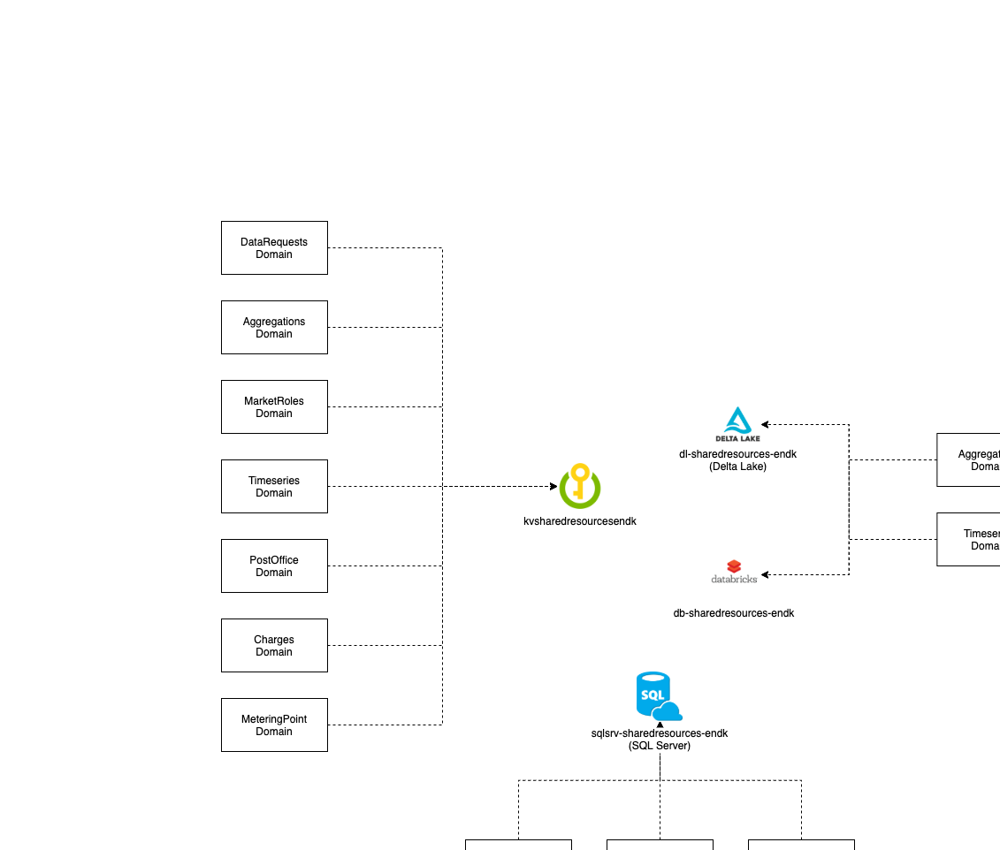

# Shared Resources

- [Intro](#intro)
- [Architecture](#architecture)
- [Domain Roadmap](#domain-roadmap)
- [Getting Started](#getting-started)
    - [Setting up the domain](#setting-up-the-domain)
    - [Using the shared resources](#using-the-shared-resources)
- [Where can I get more help](#where-can-i-get-more-help)

## Intro

This domain will contain shared components of infrastructure, as well as code which we want to "centralize".
Initially we will work towards translating incoming ebiX messages in xml to an internal CIM format.

## Architecture

## Domain Roadmap

In this program increment we are working towards:

* Shared infrastructure will be identified and established.
* Publishing a NuGet package capable of converting Danish ebiX RSM-001, RSM-004 and RSM-033 documents to CIM compliant documents.
* Creation of best practices for working and interacting with domains.

## Getting Started

### Setting up the domain

[Read here how to get started](https://github.com/Energinet-DataHub/green-energy-hub/blob/main/docs/getting-started.md).

### Using the shared resources

asdasd

## Where can I get more help?

Please see the [community documentation](https://github.com/Energinet-DataHub/green-energy-hub/blob/main/COMMUNITY.md)
